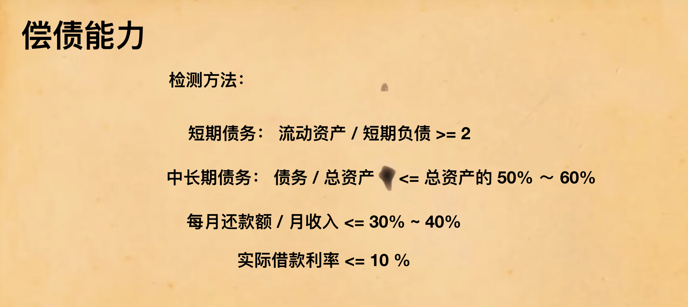

# AreYouPoor
如何做一个持家的程序员之个人财务预测之财务体检实现  

一个极（jian）简（lou）的财务体检小工具，分别从应急能力 / 偿债能力 / 储蓄能力和资产生息能力几个维度测量财务状况是否健康

# Quick Start
```bash
# 克隆
git clone git@github.com:EasterFan/AreYouPoor.git

# docker 安装 mysql
cd AreYouPoor/docker
docker-compose -f docker/docker-compose.yml up -d

# 启动
./gradlew bootRun

# 浏览器打开接口文档
http://localhost:8080/swagger-ui.html
```

# Bussiness Context
流动资产指遇到紧急情况，手中马上可用于应急的资金（通常是相当余额宝），  
日常必需月支出：维持一个月正常生活状况的总支出（吃饭 / 房租 / 水电）  
  

短期债务：比如花呗或者各种不超过1-3个月的套路贷  
中长期债务：一般就是房贷  
每月还款额：每月还花呗 / 房贷 / 信用卡和各种贷的总额  
实际借款利率：年总利息 ➗ 年总借款 （这个参数对应的是理财产品的七日年化或万份收益，都表示利息高低，只不过一个是我们收到银行利息，一个是我们给银行的利息）  
 

每月储蓄额：月底结余可用于储蓄的金额（最好是除去各种打算旅行啊健身啊各种预算后）  
每月收入： 税后工资  
 


投资资产：能带来利息的东西（余额宝 / 基金 / 股票 / 第二套房）
总资产：动产 / 不动产 所有属于你的东西
 


# Technical Stack
backend:
- springboot (JPA)
- database : (mysql + flyway + docker)
- git
- Restful
