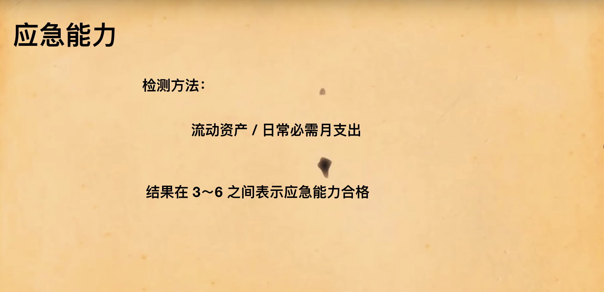

# AreYouPoor
如何做一个持家的程序员之个人财务预测之财务体检实现  

一个极（jian）简（lou）的财务体检小工具，分别从应急能力 / 偿债能力 / 储蓄能力和资产生息能力几个维度测量财务状况是否健康

# Quick Start
```bash
# 克隆
git clone git@github.com:EasterFan/AreYouPoor.git

# docker 安装 mysql
cd AreYouPoor/docker
docker-compose -f docker/docker-compose.yml up -d

# 启动
./gradlew bootRun

# 浏览器打开接口文档
http://localhost:8080/swagger-ui.html
```

# 业务背景
应急能力：  
